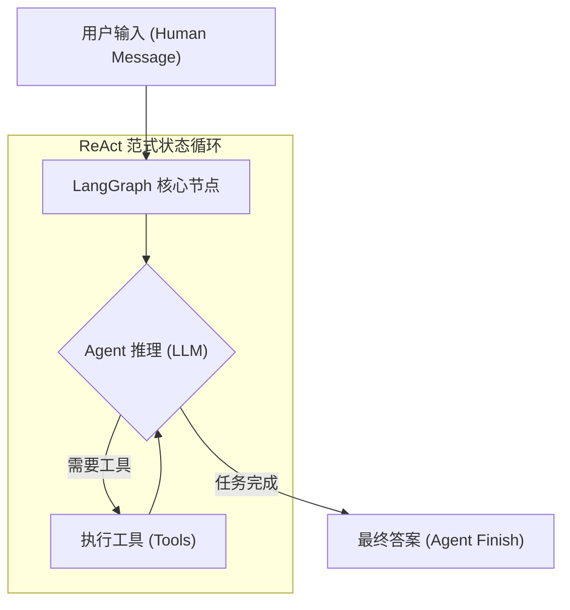

## 0. 本章知识脉络 (Chapter Overview)
根据 `README.md` 大纲要求，本章我们将建立框架与模型的最底层连接直觉。你将掌握以下核心能力：
- 🎯 **`Agent-First`理念**: 探讨从传统的线性调用跨向 LangGraph 图结构体系的源动力。
- 🎯 **`create_agent`**: 使用高层工厂函数实例化具备执行外部工具能力的智能体。
- 🎯 **`stream_mode`**: 解析更精确的 2026 版全新字典型（StreamPart）消息流控制流。

## 1. 导读与建模

- **[知识背景 / Background]**：在早期的 AI 应用中，开发者习惯使用按顺序传递的链（Chain）。但面对循环纠错和不确定工具调用时，这种线性逻辑极易崩溃。所以，现在全面引入了 Agent-First（基于图状态转移）的新范式。
- **[逻辑全景图 / Overview]**：在这套机制中，大模型是图中的核心推理节点，而外部应用作为配套节点循环工作。

- **[学习目标 / Objectives]**：掌握 `init_chat_model` 的用法，部署本地 DeepSeek 环境，并通过代码运行属于你的第一轮 ReAct 工具对话循环。

---

## 2. 核心知识点展开

### 知识点一：Agent-First 与图驱动的直觉

- **💡 原理直觉：从“单向传送带”到“联合作战室”**
  > 旧时代的 Chain 就像流水生产线上的传送带，开机就不能倒带。现在的 Agent 则是基于 Graph 构建的“联合作战沙盘”。大模型居中指挥；周围放着时钟、计算器等多个独立工具。所有节点的操作都会回写到沙盘（State 状态）中，直到问题被圆满解决为止。

- **🔍 深度注脚：忘掉过去的 `BaseLLM`**
  > 注意：为了支撑这种现代交互模式，系统要求必须有识别和返回标准化消息的能力。因此，我们在工程化落地时，需要摒弃旧日纯文本补全思路（`BaseLLM`），**统一改用 `init_chat_model` 将所有模型统一标准化并拉入网络中**。

- **🚀 代码实现与分析：统一模型声明**
  ```python
  import os
  from dotenv import load_dotenv
  from langchain.chat_models import init_chat_model

  load_dotenv()

  # 无论何种提供商，一律使用 chat_model 作为 Agent 推理基座
  llm = init_chat_model(
      model="deepseek-chat",
      model_provider="openai"
  )
  ```
  **📝 代码深度分析 (Code Analysis)**：
  1. **动态工厂接驳**：在过去，不同厂商模型需要单独导包（如 `from langchain_openai import ChatOpenAI` 或 `from langchain_anthropic import ChatAnthropic`）。随着生态庞杂，2026 年全面收束标准：`init_chat_model` 充当跨厂商的通用转接头。你只需要改变参数，代码核心逻辑无需修改。
  2. **协议伪装与复用**：之所以设置 `model_provider="openai"`，是因为 DeepSeek 官方提供了 100% 兼容 OpenAI 的 API 路由。LangChain 底层实际上正在初始化一个 `ChatOpenAI` 管道，但请求的端点是被我们的环境变量 (`OPENAI_BASE_URL`) 重定向到了 DeepSeek 的服务器。这不仅省去了安装针对性适配包的麻烦，更是目前 RAG 和 Agent 开发圈内最主流的“鸠占鹊巢”式模型接入法。

### 知识点二：使用 `create_agent` 实例化大总管

- **🚀 代码实现**
  ```python
  from langchain.tools import tool
  from langchain.agents import create_agent

  # 前置条件：已经在内存中持有了上述初始化的 `llm` 对象

  # 1. 锻造外部工具箱
  @tool
  def get_system_time(query: str) -> str:
      """返回当前系统的具体时间。"""
      import datetime
      return f"北京时间：{datetime.datetime.now().strftime('%Y-%m-%d %H:%M:%S')}"

  # 3. 实例化大总管
  agent = create_agent(
      model=llm,
      tools=[get_system_time],
      system_prompt="你是一个高效率助手。遇到时间查询必须通过工具核实。"
  )
  ```

### 知识点三：`stream_mode` 的包裹拆分与追源

- **💡 原理直觉：物流快递包裹**
  > 大模型在流式输出时产生如同“自来水”般杂乱的数据。为了理清“哪个数据是谁吐出来的”，LangGraph 采用包裹追踪机制。每一截数据流（StreamPart）都像一个“快递包裹”，上面带有 `type`（快递种类，如消息）以及最重要的 `langgraph_node` 发件人标签（说明这到底是大模型的推理输出还是工具的操作回执）。

- **🚀 代码实现**
  ```python
  query = "现在北京是几点钟？"

  # 明确声明 stream_mode="messages" 机制
  for part in agent.stream({"input": query}, stream_mode="messages"):
      # 拦截点 1：只放行普通信息类包裹
      if part["type"] == "messages":
          message, metadata = part["data"]
          
          # 拦截点 2：确认发件人只有核心的大语言模型 ("model") 本身
          if metadata.get("langgraph_node") == "model":
              # 取出核心业务内容
              if message.content:
                  print(message.content, end="", flush=True)
  ```

- **⚠️ 专家避坑**
  **关键提醒**: 很多网上老旧的资料仍然用 `for message, metadata in agent.stream(...)` 的形式取包裹。但在新版执行这种代码，将迎来致命报错：`ValueError: too many values to unpack`。
  *(关于 StreamPart 结构内含 `values, messages` 等多种数据组合详情，详见 [附录：APPENDIX.md](../APPENDIX.md) 的 A6 章节深度拆解。)*

---

## 3. 实验验证 (Lab)
讲义到此结束。纸上得来终觉浅，**现在请打开** [01_Getting_Started.ipynb](./01_Getting_Started.ipynb) 文件。
如果该文件为空或代码有待验证，请让 AI 助手补充并协助跑通底层：
1. **测试连接**：测试你本地环境变量中的 DeepSeek 配置是否通常。
2. **测试机制切换**：尝试传入不需要时间的普通询问，看模型表现。