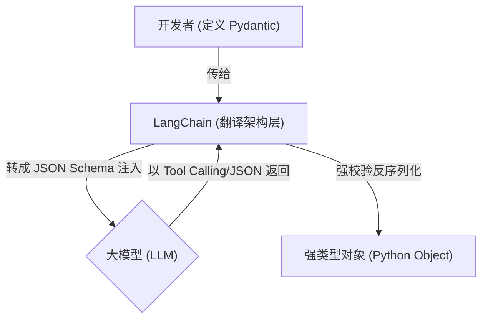

# 第 02 章：结构化输出与模型特征 (Pydantic)

## 0. 本章知识脉络 (Chapter Overview)
根据 `README.md` 大纲要求，本章我们将建立结构化思维。你将掌握以下核心能力：
- 🎯 **`.profile` 机制隐身**: 理解通过 `with_structured_output` 自动适配大模型能力的优势。
- 🎯 **`with_structured_output` 实录**: 将不可控的单向文本转化为符合 `Pydantic` 类的强类型数据载体。
- 🎯 **复合 Schema 解析**: 掌握复杂、带独立层级的系统对象输出装载与拦截。

## 1. 导读与建模

- **[知识背景 / Background]**：大模型默认以自然语言发散回答。但在真实的工程系统中，“一段自由发挥的解释”是无法写进 SQL 数据库或直接传递给下游严格类型的 Web API 的。我们需要模型规矩地输出诸如 `{"name": "张三", "age": 25}` 这般的预设格式。在旧版中，我们需要手写极易崩溃的 Regex 正则提取和强迫式提示词；但在现代架构下，系统提供了一揽子原生拦截的提取方案。
- **[逻辑全景图 / Overview]**：在这套机制中，开发者和模型面对的是截然不同层面的协议形态。

- **[学习目标 / Objectives]**：掌握构建 Pydantic Schema 的方法，并通过关联模型 API 实现极为稳定且自动转换的实体回传。

---

## 2. 核心知识点展开

### 知识点一：定义规范协议 (Pydantic 引航)

- **💡 原理直觉：打造数据模具**
  > 就像是工业界的冲压模具机。大模型脑子里的思维是无形的液态金属水，而我们将 Pydantic 作为这口模具。只要被压过，出来的就是符合所有尺寸一致标准件螺丝。如果你定义的是 `int` 但是金属水偏带了字符杂质，框架会瞬间发觉不对并尝试打回重做。

- **🚀 代码实现与分析：建立第一份模型类**
  ```python
  from pydantic import BaseModel, Field

  class UserProfile(BaseModel):
      """提取出的用户信息实体大全"""
      name: str = Field(..., description="用户的全名")
      age: int = Field(..., description="用户的年龄")
      interests: list[str] = Field(description="用户的兴趣爱好列表", default_factory=list)
  ```
  **📝 代码深度分析 (Code Analysis)**：
  1. **描述等价于 Prompt**：在你定义的类中，这些 `docstring` 以及 `Field(description="...")` 完全不是给程序员注释用的。它们最终会被 LangChain 遍历吸取出“内省表征”，并编译成极度严格的 JSON Schema 作为核心引导提示词喂给大模型。描述逻辑编写得越丰富清晰，模型进行参数提取也就越精准。
  2. **强制类型约束线**：声明的 `name: str` 等级同强类型静态限制。由于后续全交给框架反序列化包装处理，极大幅度地避免了系统因为下游获取了未达要求类型而引起整体数据链宕机的后果。

### 知识点二：绑定能力与拦截 (`with_structured_output`)

- **🔍 深度注脚：忘掉过去的 `Profile` 与手写解析器**
  > 注意：不少散碎的老文章在教初学者必须在构建前判断该模型是否具有 `JSON Mode` 能力或是否内置 `Tool Calling` 底座，从而手动分派对应执行方法。这些负担现在已经被 `with_structured_output` 的内部探测组件全揽式隐藏了起来。

- **🚀 代码实现与分析：一键结构化转换**
  ```python
  import os
  from dotenv import load_dotenv
  from langchain.chat_models import init_chat_model

  load_dotenv()
  llm = init_chat_model("deepseek-chat", model_provider="openai")

  # 【核心动作】一键绑定 Schema 拦截，封装为增强型能力模型
  structured_llm = llm.with_structured_output(UserProfile)

  query = "我叫张三，今年25岁，平时喜欢打篮球、游泳，最近还在网吧通宵打黑神话悟空。"
  
  # 直接执行并返回 Pydantic 对象，彻底告别原生态字符串的 json.loads 解析过程
  result = structured_llm.invoke(query)
  print(result.name)        # 张三
  print(result.interests)   # ['打篮球', '游泳', '打黑神话悟空']
  ```
  **📝 代码深度分析 (Code Analysis)**：
  1. **封装代理拦截模式**：通过链式调用 `with_structured_output` 实际上并未伤及原 `llm` 本体，而是返回了一个打了一层代理包裹皮的新调用体 `structured_llm`。它把拿参数的这层逻辑直接包装在了最内侧的接口回流点。
  2. **内置能力判定图 (Capabilities)**：*(详细机制见 [附录：APPENDIX.md](../APPENDIX.md) 的 A3 章节解析)* 发生绑定的那一刻起，该中间件查验了模型底层的隐藏属性档。它能够自动探测如果采用最新的官方接口则走 Native JSON 强制流；如果是旧的智力模型，则偷偷发派一个名叫 `extract_data` 的虚幻工具逼模型按调用接口方式塞入我们定下的参数，保障结果必定是你要的数据体。

### 知识点三：复合 Schema 的立体抽提策略 (Nested structures)

- **💡 原理直觉：俄罗斯套娃层级**
  > 一旦你走出测试，实战业务参数基本全都带有复合逻辑。这就像套娃模型。最外面是大包裹的收件人全称和手机，拆开大套娃，内部的参数是个单独列装的寄货地址细节类（再细切分为省、市、具体楼号）。大型语言模型天然有这种树状枝干分层结构的信息归类和关联装配智商。

- **🚀 代码实现与分析：构建组合收件单**
  ```python
  from typing import List

  # 定义独立且结构严谨的小件嵌套类
  class DeliveryAddress(BaseModel):
      province: str = Field(description="省份，无需后缀'省'")
      city: str = Field(description="城市，无需后缀'市'")
      detail: str = Field(description="详细地址")

  # 构建外部主干收件大件模型
  class OrderReceipt(BaseModel):
      """包含下属子属性组合的订单回执集合"""
      customer_name: str = Field(description="客户真实姓名")
      shipping_address: DeliveryAddress = Field(description="收件的具体详细地址体")

  # 利用大件类执行嵌套抽取动作
  order_llm = llm.with_structured_output(OrderReceipt)
  text = "我是老李，你要安排发件到这边：四川的成都市武侯区科华北路最里面那个66号居民楼下。"
  receipt = order_llm.invoke(text)

  # 从树状 Pydantic 立体模型中完美点取内层嵌套单元
  print(receipt.shipping_address.city)  # 输出 => 成都
  ```
  **📝 代码深度分析 (Code Analysis)**：
  1. **复杂依赖树的横切处理**：这段代码直接展示了 LangChain 与 Pydantic 并行联用时对多层信息的“自下而上”编译重装机制。不管层级多复杂，均通过将嵌套节点合并重组为一个立体的超大 `JSON Schema` 来发起询问。所有属性一并完成赋值组装提取，而不用拆分发起多次会话轮询！

- **⚠️ 专家避坑**
  **关键提醒**: 新手必须牢记不要对通过 `with_structured_output` 绑定后的拦截器使用 `.stream(...)` 处理。这是因为强类型数据只有接收并合并到那个结尾处半圆括号（`}`）闭合了最后的 JSON 载荷口后，才有资格进入 Pydantic 类转化步骤。在这之中的任何细小片段（半包的数据）强迫实例化必定换来 JSON Decode Parse 的解析致命错误。

---

## 3. 实验验证 (Lab)
本篇章逻辑结束。在进行这类必须要求严苛对象类型的抽离工程时往往充满了神奇的满足感。
**请转跳至专门配置的沙盘区**：[02_Structured_Output.ipynb](./02_Structured_Output.ipynb)。
(如果没有预存文件，务必在此刻将其创建为空以供后期实践调用探索)
你可以在 Jupyter 里尝试增加不合类型要求的信息量或改变模型引导 Prompt 语句来观察内部容错程度！
