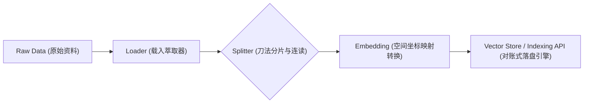

# 第 03 章：RAG 2.0 增强型数据检索

## 0. 本章知识脉络 (Chapter Overview)
根据 `README.md` 大纲要求，本章我们将进入外部知识挂接口的世界。你将深刻掌握以下核心：
- 🎯 **Vector Distribution**: 理解 Embedding 底层空间映射法则以及 `Text_Splitter` 文本切片交轨哲学。
- 🎯 **Indexing API**: 告别暴力强制落盘灌库行为，引入依靠指纹表对立验证级的 RAG 进阶索引构建管线。
- 🎯 **Context Filter**: 实现 BM25 与向量整合的双路混合搜索并在最终引入重排算法纯化。

## 1. 导读与建模

- **[知识背景 / Background]**：通用大语言模型（LLM）由于训练周期的缘故存在极重的截滞与壁垒，它对你司机密的报表或新出的规范全无所知。一旦让它不挂载知识独自猜测便极大概率造成业务危害的“幻觉弥撒现象”。RAG (Retrieval-Augmented Generation) 提供外调接口补充。但老的暴力 RAG 代码架构会无情吃干算力，并充斥极大噪音冗余。
- **[逻辑全景图 / Overview]**：在 2026 年现代生产标准化的 RAG 管线操作当中，任何文本在投喂到达前都需要通过四大防线。

- **[学习目标 / Objectives]**：完全自主掌控具备按需分片切块规则增量引擎入库系统，搭建基于混合检索的召回架构平台。

---

## 2. 核心知识点展开

### 知识点一：文本加工区与向量场映射 (Splitter & Embedding)

- **💡 原理直觉：剪切藏品与制作坐标系**
  > 一本书不可能整个拿起来扫过查询者眼前。你需要剪刀将书段拆为具有前传后继呼应功能的上下文“记忆硬纸板（Split 区块连片）”。随之，每一张带有汉字的卡片通过翻译机器翻译为极度多维度的浮点数数学标记。最后，把所有意义相近、内容相关的文字卡片按照在三维（多维度）宇宙中坐标点聚集挨近的手法排列进墙中！这也就是向量底座工作最本旨的面貌特征。

- **🚀 代码实现与分析：设立防断层的分片体系**
  ```python
  from langchain_text_splitters import RecursiveCharacterTextSplitter
  from langchain.embeddings import init_embeddings

  # 1. 初始化针对数值高频翻译优化的专门底座模型
  embeddings = init_embeddings("doubao-embedding", provider="openai")

  # 2. 将传入原始大章落拆分成安全长度并在缝隙间“倒车黏补”
  text_splitter = RecursiveCharacterTextSplitter(
      chunk_size=1000,
      chunk_overlap=200,
  )
  ```
  **📝 代码深度分析 (Code Analysis)**：
  1. **高度解耦独立包装池**：区别过往生态大杂烩，2026 版 LangChain 的数据洗切加工均彻底打包在独立的 `langchain-text-splitters` 包中维护。这代表分词生态在项目核心级中的去耦特性提升。
  2. **Overlap 切点的强补逻辑**：大模型需要阅读语境，`chunk_overlap=200` 就像是每到切割边缘的时候在下一段向回再挪两百字作连接扣。这样一来能确切挽回某些名词被“腰斩在切割线刀口”下半截缺少主语解释的惨烈灾祸，维护意义在每个节点块上的完整表现形态。

### 知识点二：按需进舱过滤与记录层 (Indexing API)

- **🔍 深度注脚：暴力灌装（`from_documents`）彻底停办**
  > 注意：曾经市面上随便一份烂俗教材全在手搓 `VectorStore.from_documents` 。这种动作如果部署在一个有调度周期日更抓取的线上程序，会导致所有已经计算落库的没改变的内容每天重复消耗网络带宽和天文等级的扣费金额。现代体系强制采用加入了 `SQLRecordManager` 的账簿式审核插入路线！ 

- **🚀 代码实现与分析：建立对账级入库网闸**
  ```python
  from langchain_chroma import Chroma
  from langchain_classic.indexes import index, SQLRecordManager

  # 1. 直接连接落地于持久目录内的向量容纳器 (Chroma)
  vectorstore = Chroma(
      collection_name="my_private_knowledge",
      embedding_function=embeddings,
      persist_directory="./chroma_db"
  )

  # 2. 设立对账大队 SQLite 经理人 (存留数据指纹账单而已)
  record_manager = SQLRecordManager("chroma/my_private_knowledge", db_url="sqlite:///record_manager_cache.sql")
  record_manager.create_schema()

  # 3. 数据流在插入执行动作前，先经过严苛检视与对账过滤判断 
  result = index(
      docs_source=splits,            # 新产生与进入处理池的全部切片集合
      record_manager=record_manager, # 对账管家（提供缓存比对记录）
      vector_store=vectorstore,      # 仓门存储间
      cleanup="incremental",         # 清理动作：自动剔除不再出现在最新源内且过期的指纹卡片
      source_id_key="source"
  )
  print(result) # 控制台可监控到有多少个 skip 与真正发起 API 的 added 块
  ```
  **📝 代码深度分析 (Code Analysis)**：
  1. **指纹校验闭环（Hash 撞库防护）**：*(机制的源理深查请见 [附录：APPENDIX.md](../APPENDIX.md) 的 A7 记录)* 我们使用了这套组合拳后，系统在拿到文本瞬间其实在默默计算每句话特属哈希码，发去跟 sqlite 里面旧有哈希清单查询一遍。只有在没见过（新文章段）、或发生了更正的情况，才向云端发起耗费请求做 Embedding 并填进 Chroma ，这样实现了完美的绿色工业“增存差分迭代”操作。

### 知识点三：混合检索互补阵营 (Hybrid Search & Filter)

- **💡 原理直觉：让语义泛化兼容冷库文字特攻**
  > 向量虽然在泛泛了解内容语义（“着凉”就是“受寒”）时神勇，但真碰到精准对位冷编码字眼（你给我搜包含机箱“Z170X”字符主板手册）由于没有相近语意可能抓瞎。混合搜索就是同时调动两位大牛探员查案。一个用感觉意图破案，一个用机械词组死对对案！

- **🚀 代码实现与分析：融合两部阵营兵力汇聚裁判所**
  ```python
  from langchain.retrievers import EnsembleRetriever
  from langchain_community.retrievers import BM25Retriever

  # 阵列一：构建极其看重词频分词与刻板对应关联的检索大队 (如 BM25 古典学派)
  bm25_retriever = BM25Retriever.from_documents(splits)
  bm25_retriever.k = 3

  # 阵列二：提取之前早些时间做好的能够领悟精神意向距离维度的智能检搜器 (Vector)
  vector_retriever = vectorstore.as_retriever(search_kwargs={"k": 3})

  # 裁判合并裁判庭执行综合考量权
  hybrid_retriever = EnsembleRetriever(
      retrievers=[bm25_retriever, vector_retriever],
      weights=[0.5, 0.5] 
  )

  # 发起无缝互联呼叫
  docs = hybrid_retriever.invoke("我要查这笔精准的开票号码：1001-AABBCC")
  ```
  **📝 代码深度分析 (Code Analysis)**：
  1. **多域调和排名（RRF 对倒术）**：`EnsembleRetriever` 后台使用了 Reciprocal Rank Fusion 这一高级融合计法。原因是古典算法给的是纯粹得分数值大集合，向量给的余弦计算出来是相似度 0～1 小数值。如果拿苹果直接合计算橘子的数字绝对翻车。所以，算法核心抛弃分数强制提取只管他原本在自己池子里面占的名次排序，实现了大局融合评判方案的公允性。

- **⚠️ 专家避坑**
  **关键提醒**: 新手最易搞破坏的操作：由于老式的 BM25 对文档其实仅仅是一套频数内存模型算法。请你绝对不要异想天开尝试把 BM25 装在 Chroma 这种真正的带有外部存储的重型体系中。`Vector` 会持久存放它，而频数倒排这种只需内存读取源重构的小玩意不需要入库保存。

---

## 3. 实验验证 (Lab)
这些工业界真实存在的严苛进仓关卡将让你的挂载真正具备大规模扩充并持续更替的不宕机特性。
**我们现在转场前往**：[03_RAG_2.0.ipynb](./03_RAG_2.0.ipynb) (若不存则优先建立空的关联体) 进行验证敲击测试！
尝试不断删除并重新喂入某小段知识修改内容进流水线框子里面去，亲眼捕捉并检查打印出现的那个令人安心的庞大 skipped 字样！
