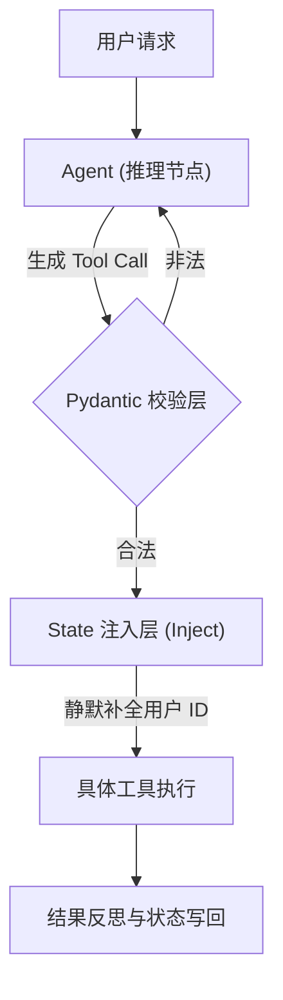

# 第 04 章：高级工具调用 (Smart Tooling)

## 0. 本章知识脉络 (Chapter Overview)
根据 `README.md` 大纲要求，本章我们将从“能用工具”跃迁到“如何安全、鲁棒地驾驭工具”。你将掌握以下核心能力：
- 🎯 **契约化建模**: 深入 Pydantic v2，理解如何通过 args_schema 构建 LLM 无法逾越的类型防线。
- 🎯 **运行时上下文注入**: 揭秘 `InjectedState` 机制，实现在不暴露敏感信息给 LLM 的前提下完成权限透传。
- 🎯 **Schema 遵循度优化**: 探讨针对幻觉参数的防御式编程与自动重试策略。

## 1. 导读与建模

- **[知识背景 / Background]**：在早期的工具调用中，开发者仅依赖 Python 函数的 docstring。但在复杂的工业场景下，模型往往会编造不存在的参数（如假的 `user_id`）或混淆嵌套的 JSON 结构。
- **[逻辑全景图 / Overview]**：工具调用不再是一个简单的“触发-执行”过程，而是一个具备“校验-注入-反思”闭环的契约化流程。

- **[学习目标 / Objectives]**：掌握 `args_schema` 的显式定义，通过 `Annotated` 实现静默参数注入，并构建一个具备安全审计能力的文件管理 Agent。

---

## 2. 核心知识点展开

### 知识点一：用 Pydantic v2 锻造“契约化”工具

- **💡 原理直觉：从“口头协议”到“公证合同”**
  > docstring 就像是邻居间的口头协议，模糊且容易产生误解。而 Pydantic Schema 则是签署了正式公证的“契约合同”。LLM 必须严格阅读合同条款（字段定义、默认值、数值范围）才被允许执行。

- **🔍 深度注脚：args_schema 的强制性**
  > 注意：在 `@tool` 装饰器中显式传递 `args_schema` 能确保 LangChain 生成一个完美的 `json_schema` 映射。这对于 Qwen 或 Llama 等非 OpenAI 模型尤为重要，因为它可以极大降低模型生成非法 JSON 结构的概率。

- **🚀 代码实现**
  ```python
  from langchain_core.tools import tool
  from pydantic import BaseModel, Field

  class SearchArgs(BaseModel):
      query: str = Field(description="搜索关键词")
      limit: int = Field(default=5, description="结果数量", ge=1, le=10)

  @tool(args_schema=SearchArgs)
  def smart_search(query: str, limit: int = 5):
      """一个增强型搜索工具，具有严格的数值约束。"""
      return f"Searching for {query} (Limit: {limit})"
  ```
  **📝 代码深度分析 (Code Analysis)**：
  1. **元数据透传**：`Field` 中的 `description` 会被提取到 JSON Schema 的 `description` 字段中，直接成为 LLM 的 Prompt 提示。
  2. **硬约束校验**：`ge=1, le=10` 等 Pydantic 校验器会在函数执行前进行拦截。如果 LLM 尝试传入 `20`，框架会抛出 ValidationError，我们可以在 Graph 中捕获该错误并让模型重试。

### 知识点二：运行时上下文注入与安全隔离

- **💡 原理直觉：餐厅的隐形账单**
  > 就像你在高档餐厅点餐，LLM 是“点菜员”，它只需负责说“来一份牛排”；而“桌号”信息是由服务生（框架状态）自动贴在订单上的，客人和点菜员都不需要感知。

- **🔍 深度注脚：为什么 LLM 必须“盲视”？**
  > 如果让 LLM 决定 `user_id`，它极易产生幻觉误改他人的数据。通过 `InjectedState` 注入，我们实现了逻辑（Agent 负责）与安全（系统框架负责）的完美隔离。

- **🚀 代码实现**
  ```python
  from typing import Annotated
  from langgraph.prebuilt import InjectedState
  from langchain_core.tools import tool

  @tool
  def secure_delete(
      item_id: str,
      user_id: Annotated[str, InjectedState("user_id")] # 对 LLM 隐藏
  ):
      """删除指定文件。注意：模型只需提供 item_id 即可。"""
      return f"用户 {user_id} 发起了删除项 {item_id} 的请求。"
  ```

### 知识点四：揭秘调度者 (The Dispatcher) —— 谁按下了执行开关？

💡 **原理直觉：指挥官与通信兵**
> LLM 是“在大本营指挥的将军”，它负责发号施令（Tool Calls）。但它不出门，也不开枪。`ToolNode` 或框架里的循环逻辑是“通信兵”，它负责听懂指令，跑去武器库调拨资源（注入状态），并真正开火（执行代码）。

🔍 **深度注脚：为什么第 01 章能“自动”运行？**
> 在第 01 章中，我们使用的 `create_agent` 是一个**预制工厂函数**。它在内部为你自动构建了一个包含“推理节点”和“执行节点”的小型图（Graph）。你之所以感觉不到“手”的存在，是因为工厂已经把手和大脑缝合在一起了。

🚀 **手动调度的逻辑演示**

在大脑生成意图后，执行者需要完成以下动作：
1. **解析**：从 `AIMessage` 中提取 `tool_calls`。
2. **路由**：寻找对应的函数。
3. **注入**：如果是 `InjectedState` 参数，从当前 Session 提取并合并。
4. **回执**：执行后生成 `ToolMessage`。

---

## 4. 动手实验 (Lab)：构建一个智能文件操作系统

讲义到此结束。**现在请打开** [04_Smart_Tooling.ipynb](./04_Smart_Tooling.ipynb) 文件进行实战。
你需要完成以下任务：
1. **Schema 打印挑战**：运行代码并观察 `secure_delete` 打印出的输入 Schema，验证 `user_id` 是否真的被隐藏了。
2. **防御式重试验证**：尝试手动修改 Tool Call 参数为非法值，观察 Agent 是否能够根据报错信息进行“修辞补偿”并修正参数。
3. **安全注入实验**：在不手动向工具传参的情况下，通过 LangGraph 的 `Config` 注入模拟的 `user_id` 并跑通流程。
4. **揭秘调度者**：手动实现一个“零魔法”的工具自动调度器。