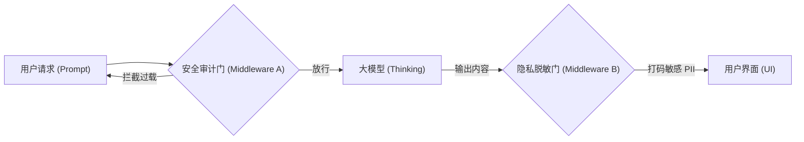

# 第 05 章：Agent 中间件 (Agent Middleware)

## 0. 本章知识脉络 (Chapter Overview)
根据 `README.md` 大纲要求，本章我们将建立面向生产环境的“环保护航”意识。你将掌握以下核心能力：
- 🎯 **`with_listeners`**: 事件监测钩子，实现对 Agent 推理全生命周期的非侵入式追踪。
- 🎯 **`with_fallbacks`**: 高可用架构的核心。当主模型（如 DeepSeek）响应失败时，建立秒级自动补位的回退策略。
- 🎯 **`Custom Redactor`**: 自定义内容脱敏逻辑，在隐私数据（PII）离开缓冲区前完成安全打码。
- 🎯 **`Human-in-the-loop`**: 初探中断机制，学会在关键动作执行前引入“人类的最后一道防线”。

## 1. 导读与建模

- **[知识背景 / Background]**：在经典的软件架构中，中间件（Middleware）负责处理核心逻辑之外的横切关注点（审计、安全、容错）。在 Agent 中，由于大模型输出的不可控性和网络 API 的不稳定性，我们不能让“大脑”直接裸奔，必须为其加装防御性的“防护壳”。
- **[逻辑全景图 / Overview]**：中间件像是一系列的“安检门”，它被挂载在通往外部的所有路口上。

- **[学习目标 / Objectives]**：实现一个能自动检测并脱敏手机号的中间件，并构建一个具备主备切换能力的健壮 Agent 推理节点。

---

## 2. 核心知识点展开

### 知识点一：全方位监测与事件监听 (Observability Hooks)

- **💡 原理直觉：全景黑匣子录像机**
  > `with_listeners` 就像是不依赖于主电路的“黑匣子录像机”。哪怕主电路（代码逻辑）在运行，它也会在每一次启动和结束时，独立记下一笔当前的执行状态，且完全不干扰主逻辑的速度。

- **🔍 深度注脚：非侵入式设计的边界**
  > 注意：`with_listeners` 只能“看”，不能“改”。如果你想在推理中途动态修改数据流，这并不是它的职责，你应该去使用更复杂的拦截层。

- **🚀 代码实现与分析：审计监听器**
  ```python
  from langchain_core.runnables import RunnableLambda

  def on_start(run):
      print(f"--- [审计日志] 任务开始，ID: {run.id} ---")

  def on_end(run, output):
      print(f"--- [审计日志] 任务结束，输出长度: {len(str(output))} ---")

  # 通过链式调用挂载监听器
  monitored_chain = llm.with_listeners(on_start=on_start, on_end=on_end)
  ```
  **📝 代码深度分析 (Code Analysis)**：
  1. **解耦监控**：你不需要在你的业务代码里写满 `print`，所有的审计逻辑都被收束在监听器中。
  2. **异步兼容性**：在 2026 年的生产环境中，`with_listeners` 支持 `RunnableConfig` 里的所有元数据，方便与 LangSmith 或自研监控平台进行 ID 关联。

### 知识点二：高可用架构与容错策略 (Resilience & Fallbacks)

- **💡 原理直觉：数据中心的备用发电机**
  > 当大模型（如 DeepSeek）因为并发过高而报 503 错误时，`with_fallbacks` 就是那台瞬间接火的“备用发电机”。它会自动感知主线路的断裂，并立刻将流量导向备用线路（如本地托管的小模型或 OpenAI），确保用户侧服务永远不中断。

- **🚀 代码实现与分析：主备模型切换**
  ```python
  # 定义核心大脑与后备方案
  primary_llm = ChatOpenAI(model="deepseek-chat")
  backup_llm = ChatOpenAI(model="gpt-4o-mini")

  # 建立自动补位系统
  robust_llm = primary_llm.with_fallbacks([backup_llm])
  ```

---

### 知识点三：内容安全与脱敏中间件 (Safety & Redaction)

- **💡 原理直觉：阅后即焚的自动涂改器**
  > 对某些敏感信息（如身份证、API Key），我们希望模型生成的原文留在后台，但发给前端显示时必须覆盖上一层“黑色胶带”。自定义脱敏类就是这个执行最后涂改动作的手。

- **🚀 代码实现与分析：自研脱敏拦截器**
  ```python
  import re

  def pii_redactor(input_text: str) -> str:
      """将手机号脱敏为 138****0001"""
      pattern = r"(\d{3})\d{4}(\d{4})"
      return re.sub(pattern, r"\1****\2", input_text)

  # 利用 RunnableLambda 包装为管道中的一个中间件节点
  redact_middleware = RunnableLambda(lambda x: pii_redactor(x.content))
  ```

### 知识点四：人工干预与审批流 (Human-in-the-loop)

- **💡 原理直觉：Agent 的物理断路器**
  > 就像是银行大额取款需要双人授权，或者核武器发射需要两把钥匙同时转动。对于高风险操作（如资产转账、核心库删除），Agent 的“全自动执行”反而是一种巨大的安全隐患。我们需要在“推理”和“真正执行动作”之间，强制插入一个属于人类的断路器。

- **🔍 深度注脚：为什么 `input()` 不够用？**
  > 注意：在学习中，我们能用 `input()` 阻塞 Python 进程来模拟。但在真正的生产 Web 系统中（如 FastAPI 部署），你无法阻塞线程等待用户。这也就是为什么在 **第 07 章** 中我们需要学习 LangGraph 的 `interrupt` 机制——它是通过“持久化挂起并在重启时恢复”来实现分布式环境下的人工审批。

- **🚀 代码实现与分析：手动确认拦截**
  ```python
  def human_guard(intent: dict) -> bool:
      """中间件逻辑：人工最后确认层"""
      print(f"--- [安全预警] AI 申请转账 {intent['amount']} ---")
      if input("确认执行？[Y/n]: ").upper() == "Y":
          return True
      return False
  ```
  **📝 代码深度分析 (Code Analysis)**：
  1. **意图先行 (Reasoning Pre-Action)**：这段代码必须放在工具调用的**前置位置**。它利用了 LLM 已经预测出的参数作为审核依据。
  2. **权限隔离**：即便是 Agent 认为该操作是“合法的”，由于它是中间件，它拥有比 Agent 本身更高的逻辑权限，可以实现“一票否决权”。

---

## 3. 实验验证 (Lab)

讲义到此结束。**现在请打开** [05_Agent_Middleware.ipynb](./05_Agent_Middleware.ipynb) 文件进行实战。
你将作为“安全官”完成以下任务：
1. **多重补位实验**：故意给 `primary_llm` 设置错误的 URL，看中间件是否能自动切换到 `backup_llm`。
2. **多重拦截挑战**：构建一个链，它必须先通过“PII 脱敏”门，再通过“审计日志”门。
3. **审批沙盘**：初步体验如何让 Agent 暂停，并在本地获得你的“OK”指令后继续执行。
