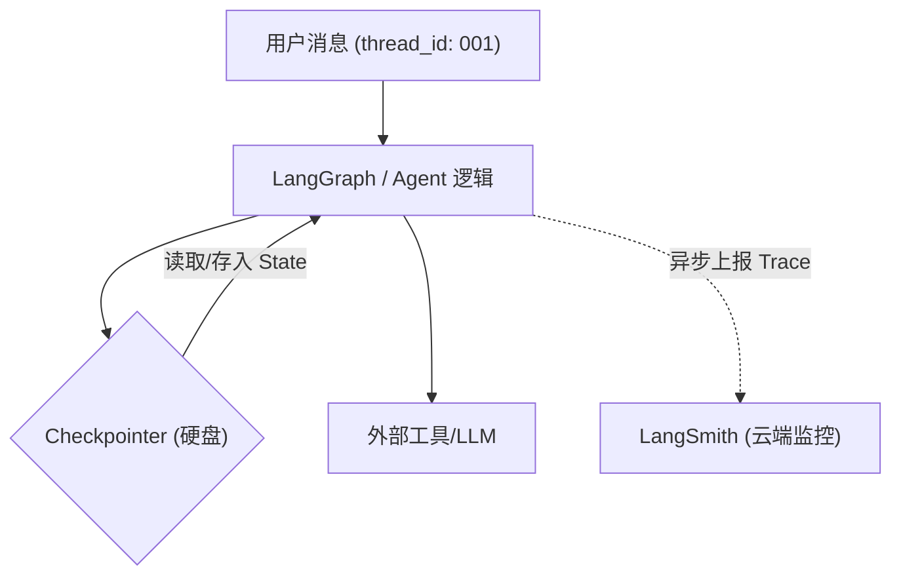

# 第 06 章：基础设施 (Observability & Persistence)

## 0. 本章知识脉络 (Chapter Overview)
在本章中，我们将 Agent 从“单机脚本”进化为“生产级系统”。你将掌握：
- 🎯 **LangSmith 全生命周期追踪**: 建立 `LANGCHAIN_TRACING_V2` 环境，将推理过程可视化。
- 🎯 **Checkpointer 持久化**: 引入 `MemorySaver`，理解 Agent 如何利用“存储快照”实现长效记忆。
- 🎯 **Thread ID 隔离**: 掌握多租户环境下，如何通过线程 ID 隔离不同用户的对话上下文。

## 1. 导读与建模

- **[知识背景 / Background]**：大语言模型（LLM）本身是无状态（Stateless）的。它就像一个有间歇性失忆症的天才，每次对话都是一张白纸。在真实的工程中，我们需要一个“外部硬盘”来实时保存它的思维状态和对话历史。同时，为了调试复杂的工具调用，我们必须有一套“录像系统”来回溯它到底是在哪一步产生了幻觉。
- **[逻辑全景图 / Overview]**：

- **[学习目标 / Objectives]**：配置 LangSmith 追踪环境，并实现一个即便重启 Notebook 也能延续对话的记忆分身。

---

## 2. 核心知识点展开

### 知识点一：LangSmith —— Agent 的显微镜 (Tracing)

- **💡 原理直觉：全链路数字化录像**
  > 如果说 `print` 是在墙上贴小广告，那 LangSmith 就是全城监控摄像头。它能记录下 Prompt 被翻译成什么 JSON、工具返回了什么原始报错、甚至每一秒产生了多少 Token 消耗。

- **🚀 环境配置分析 (Environment Setup)**：
  在 `.env` 中增加以下配置，LangChain 框架会自动拦截并上报所有流量：
  ```bash
  LANGCHAIN_TRACING_V2=true
  LANGCHAIN_API_KEY=ls__...  # 你的 LangSmith API Key
  LANGCHAIN_PROJECT="Logbook-Lab"
  ```
  **📝 观测要点 (What to Watch)**：
  1. **Latency (时延)**：哪一个步骤最慢？（通常是检索或复杂推理）。
  2. **Inputs/Outputs**：模型接收到的原始 Schema 是否正确？注入的参数生效了吗？

#### 🔍 开源平替：LangFuse 与自建监测
> **[工程决策 / Production Decision]**：如果你所在的组织对数据隐私有极高要求，或者希望规避 LangSmith 的付费成本，**LangFuse** 是目前的最佳开源方案。
> - **零侵入切换**：LangChain 提供了标准的回调处理器（Callback Handler），只需将 `on_end` 等钩子对接到 LangFuse 服务器，即可实现与本章实验相同的监控效果。
> - **私有化部署**：支持 Docker 部署在公司内网，彻底解决数据不出库的问题。

### 知识点二：Checkpointer —— 会话的“存档点” (Persistence)

- **💡 原理直觉：单机会话的存档机制**
  > 就像单机游戏里的“Save & Load”。Agent 运行完一个节点，系统就会自动把当前的 `State`（包括对话历史、变量）生成一个二进制快照存进数据库。下次你带着同一个卡槽（`thread_id`）回来，Agent 瞬间就能读档恢复。

- **🔍 深度注脚：Thread_ID 的业务含义**
  > `thread_id` 是区分业务会话的唯一标识。它是实现“多用户对话隔离”的物理防线。

- **🚀 代码实现与分析：注入持久化层**
  ```python
  from langgraph.checkpoint.memory import MemorySaver

  # 1. 创建内存级存档器（生产环境可用 Redis/Postgres 替代）
  memory = MemorySaver()

  # 2. 在构建 Agent 时绑定存档点
  # (此处以 create_agent 简化演示，后续章节将手写 StateGraph)
  agent = create_agent(llm, tools, checkpointer=memory)

  # 3. 调用时必须指定配置
  config = {"configurable": {"thread_id": "user_123"}}
  agent.invoke({"input": "我的名字是张三"}, config=config)
  ```
  **📝 代码深度分析 (Code Analysis)**：
  1. **Configurable 协议**：所有的持久化信息都通过 `config` 参数透传。这是一个“侧信道”协议，不会干扰你的业务 Input 内容。
  2. **状态快照机制**：如果在执行工具时程序崩溃，下一次相同 ID 的请求可以从这个断点直接恢复（Time Travel 的基础）。

---

## 3. 实验验证 (Lab)

讲义到此结束。**现在请打开** [06_Observability_Persistence.ipynb](./06_Observability_Persistence.ipynb) 文件进行实战。
你将完成以下硬核任务：
1. **监控激活**：在 LangSmith 后台亲手创建一个专案，并观测你的第一次追踪轨迹。
2. **失忆测试**：对比在不传 `thread_id` 和传输 `thread_id` 时，Agent 表现出的截然不同的智力稳定性。
3. **快照查看**：手动读取 `MemorySaver` 里的二进制快照，看看里面到底存了什么。
